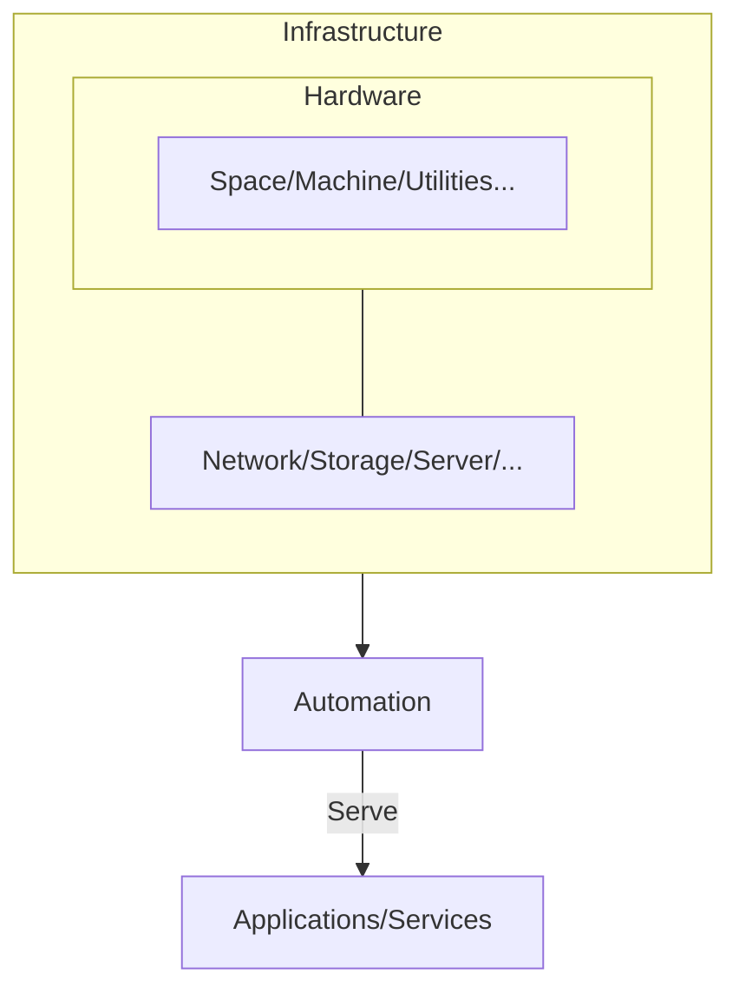
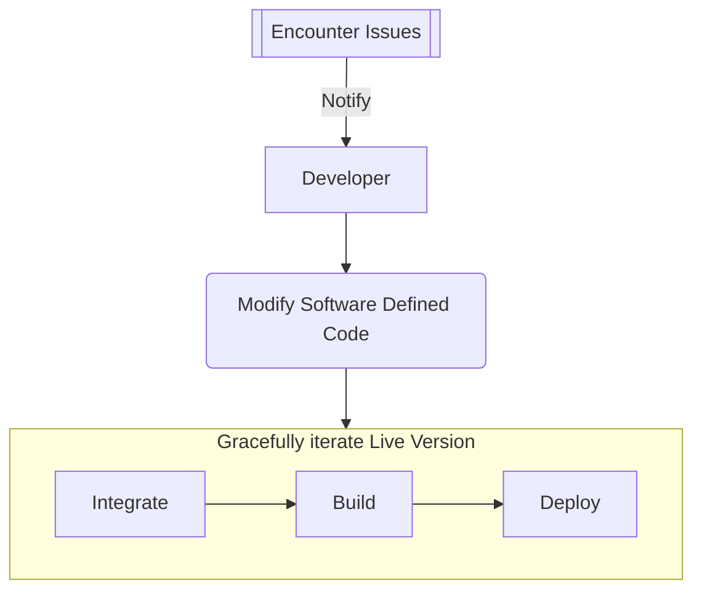
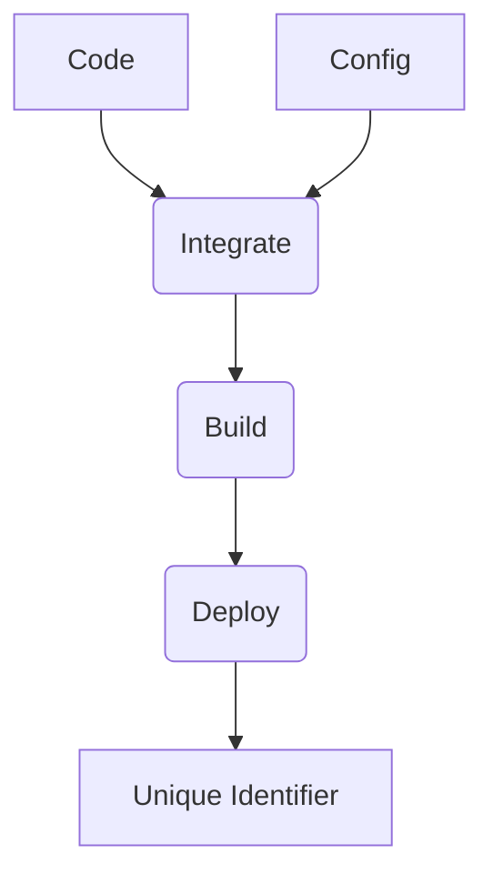
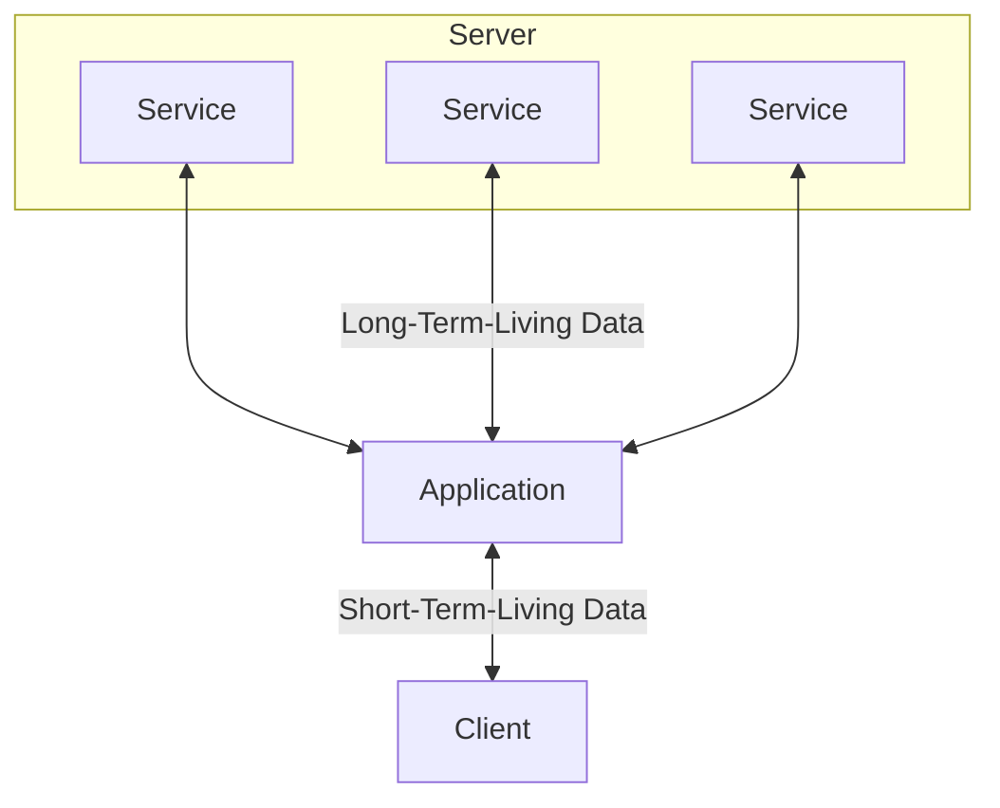
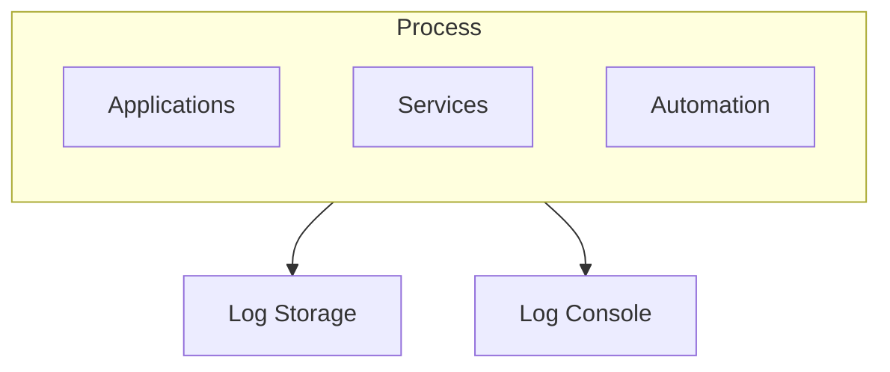
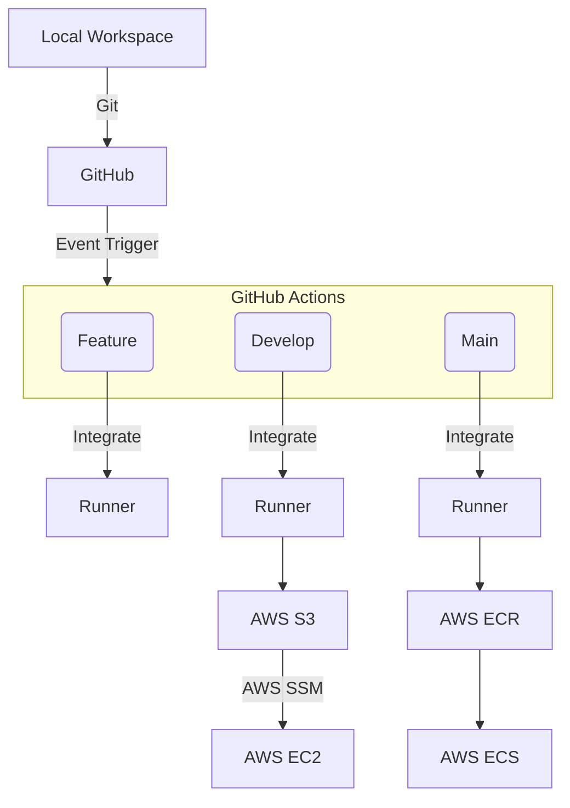
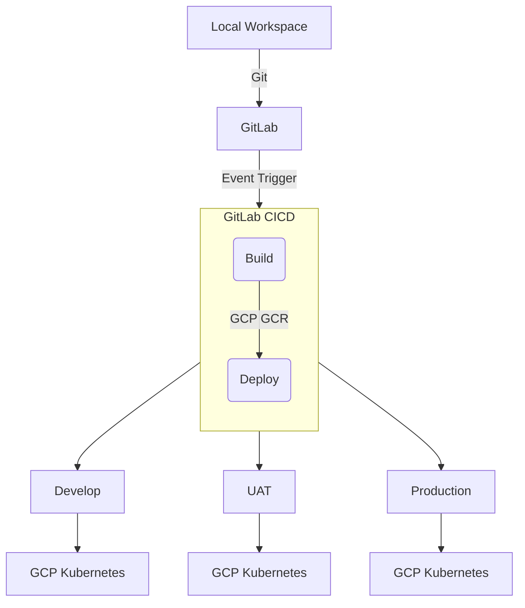
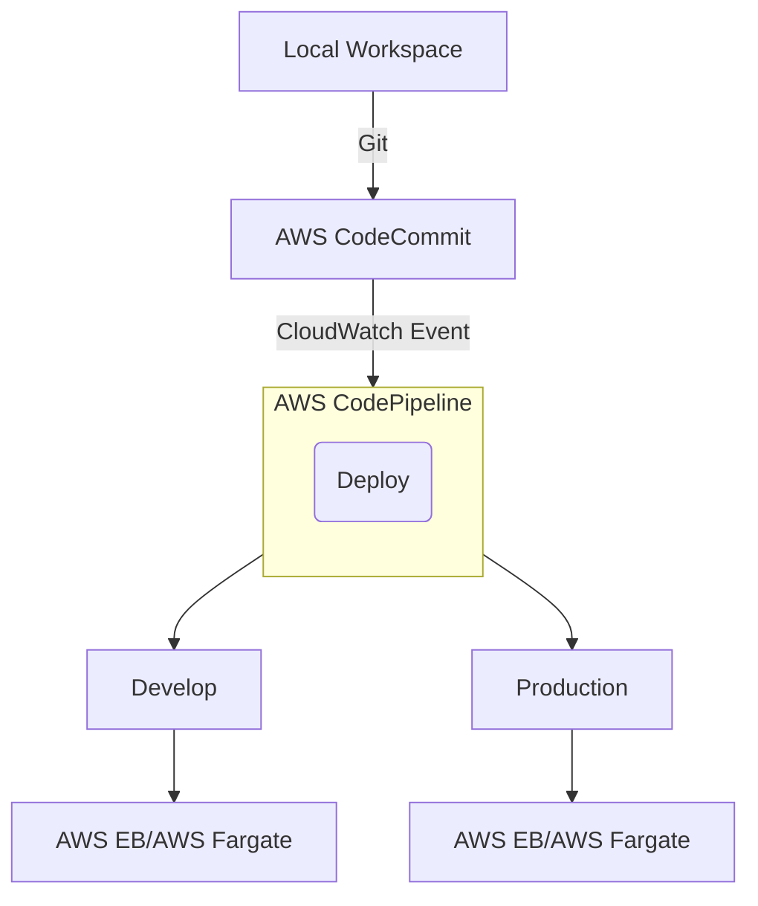
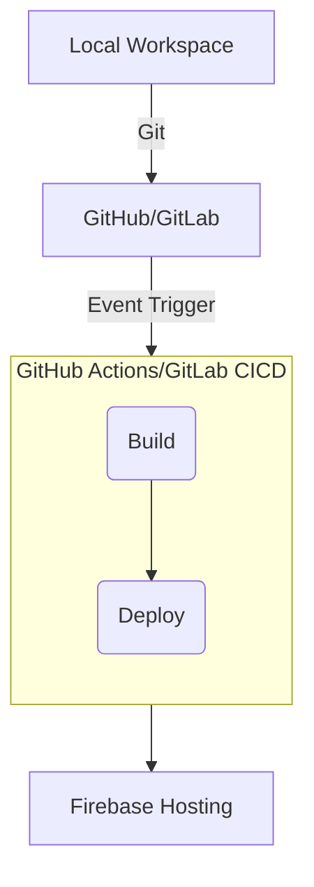

```mermaid
flowchart TB
    A --> B[Automation]
    B -->|Serve| K[Applications/Services]
    subgraph A[Infrastructure]
        direction TB
        subgraph Hardware
            Z[Space/Machine/Utilities...]
        end
        Hardware --- C[Network/Storage/Server/...]
    end
```

### Immutable

```mermaid
flowchart TD
    A[[Encounter Issues]] -->|Notify| B[Developer]
    B --> C(Modify Software Defined Code)
    C --> D
    subgraph D [Gracefully iterate Live Version]
        direction LR
        Integrate --> Build
        Build --> Deploy
    end
```

### Build and Deploy

```mermaid
flowchart TD
    A[Code] --> I(Integrate)
    Config --> I
    I --> B(Build)
    B --> D(Deploy)
    D --> E[Unique Identifier]
```

### Stateless Processes

```mermaid
flowchart TB
    subgraph Server
        A[Service]
        C[Service]
        D[Service]
    end
    A <--> B[Application]
    C <--->|Long-Term-Living Data| B
    D <---> B
    B <-->|Short-Term-Living Data| G[Client]
```

### Logs

```mermaid
flowchart TB
    subgraph Process
        direction TB
        A[Applications]
        B[Services]
        C[Automation]
    end

    Process --> D[Log Storage]
    Process --> E[Log Console]
```

### Real-World Cases

```mermaid
flowchart TB
    A[Local Workspace] -->|Git| B[GitHub]
    B -->|Event Trigger| C
    subgraph C[GitHub Actions]
        direction TB
        Feature(Feature)
        Develop(Develop)
        Main(Main)
    end
    Feature -->|Integrate|I1[Runner]
    Develop -->|Integrate|I2[Runner]
    I2 --> S3[AWS S3]
    S3 -->|AWS SSM| EC2[AWS EC2]
    Main --> |Integrate|I3[Runner]
    I3 --> ECR[AWS ECR]
    ECR --> ECS[AWS ECS]
```

```mermaid
flowchart TB
    A[Local Workspace] -->|Git| B[GitLab]
    B -->|Event Trigger| C
    subgraph C[GitLab CICD]
        direction TB
        Build(Build) -->|GCP GCR| Deploy(Deploy)
        Deploy
    end
    C --> Develop
    C --> UAT
    C --> Production
    Develop --> K1[GCP Kubernetes]
    UAT --> K2[GCP Kubernetes]
    Production --> K3[GCP Kubernetes]
```

```mermaid
flowchart TB
    A[Local Workspace] -->|Git| B[AWS CodeCommit]
    B -->|CloudWatch Event| C
    subgraph C[AWS CodePipeline]
        direction TB
        Deploy(Deploy)
    end
    C --> Develop
    C --> Production
    Develop --> G1[AWS EB/AWS Fargate]
    Production --> G2[AWS EB/AWS Fargate]
```

```mermaid
flowchart TB
    A[Local Workspace] -->|Git| B[GitHub/GitLab]
    B -->|Event Trigger| C
    subgraph C[GitHub Actions/GitLab CICD]
        direction TB
        Build(Build) --> Deploy(Deploy)
    end
    C --> G1[Firebase Hosting]
```
