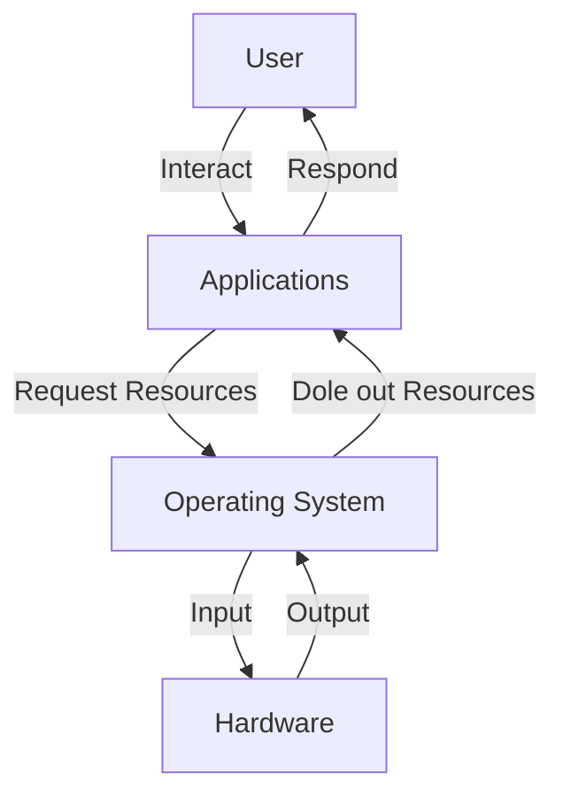

Operating System 與其他階層的關係如下。可以看見，這 4 個 Layer 是 Insulated 絕緣的，User 不可直接與 Operating System 互動，正如 Applications 不可使用 Hardware：

```mermaid
flowchart TB
A[User] --> |Interact| B[Applications];
B --> |Respond| A;
B --> |Request Resources| C[Operating System];
C --> |Dole out Resources| B;
C --> |Input| D[Hardware];
D --> |Output| C;
```
