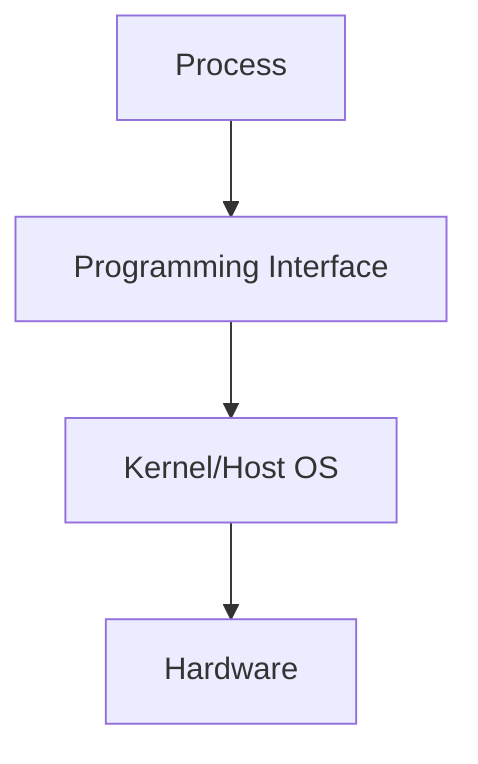
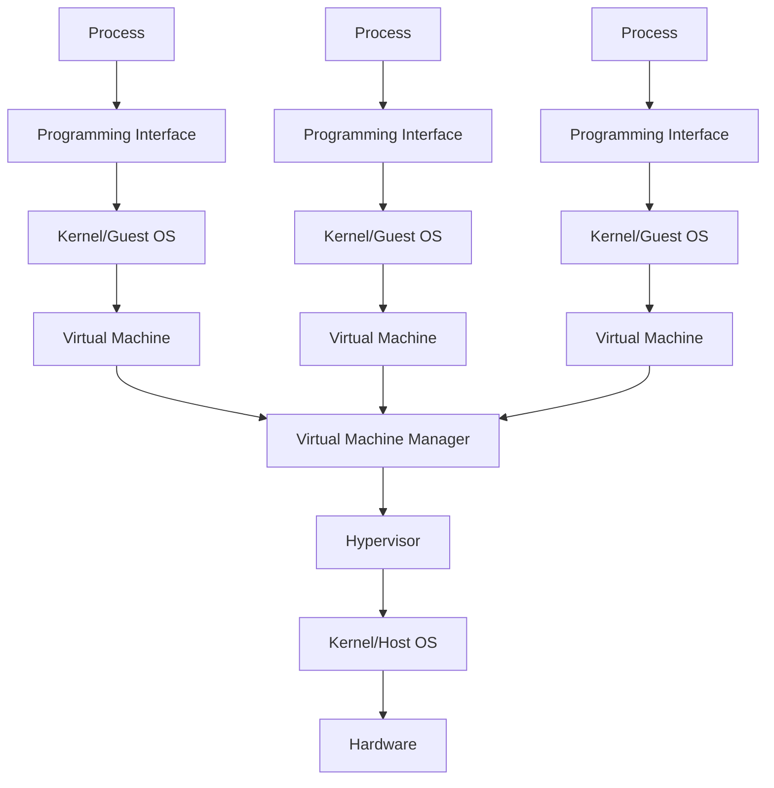
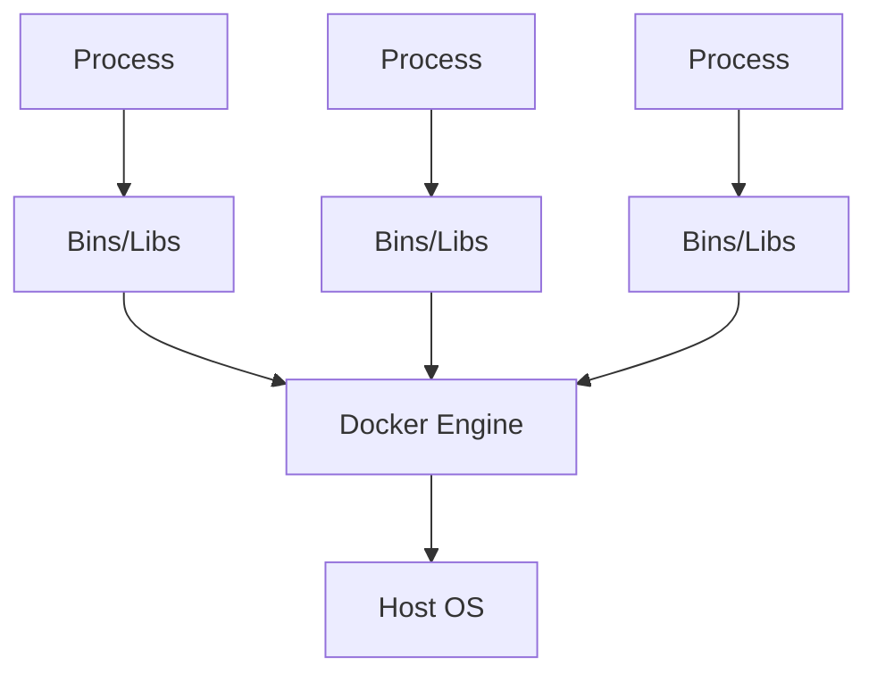

OS:

```mermaid
flowchart TB
    Process --> PI[Programming Interface]
    PI --> HOS[Kernel/Host OS]
    HOS --> Hardware
```

VM:

```mermaid
flowchart TB
    Process1[Process] --> PI1[Programming Interface]
    PI1 --> Kernel1[Kernel/Guest OS]
    Kernel1 --> VM1[Virtual Machine]
    VM1 --> VMM[Virtual Machine Manager]

    Process2[Process] --> PI2[Programming Interface]
    PI2 --> Kernel2[Kernel/Guest OS]
    Kernel2 --> VM2[Virtual Machine]
    VM2 --> VMM[Virtual Machine Manager]

    Process3[Process] --> PI3[Programming Interface]
    PI3 --> Kernel3[Kernel/Guest OS]
    Kernel3 --> VM3[Virtual Machine]
    VM3 --> VMM[Virtual Machine Manager]

    VMM --> Hypervisor
    Hypervisor --> HOS[Kernel/Host OS]
    HOS --> Hardware
```

Docker:

```mermaid
flowchart TB
    Process1[Process] --> BL1[Bins/Libs]
    BL1 --> DE[Docker Engine]

    Process2[Process] --> BL2[Bins/Libs]
    BL2 --> DE[Docker Engine]

    Process3[Process] --> BL3[Bins/Libs]
    BL3 --> DE[Docker Engine]

    DE --> HOS[Host OS]
```
