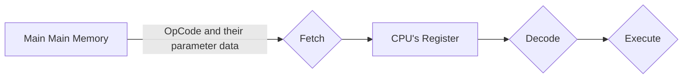

不斷重複直到完成指令，CPU 每秒可執行數百萬次 Cycle：

```mermaid
flowchart LR
   A[Main Main Memory] --> |OpCode and their parameter data| B{Fetch};
   B --> C[CPU's Register];
   C --> D{Decode};
   D --> E{Execute};
```
